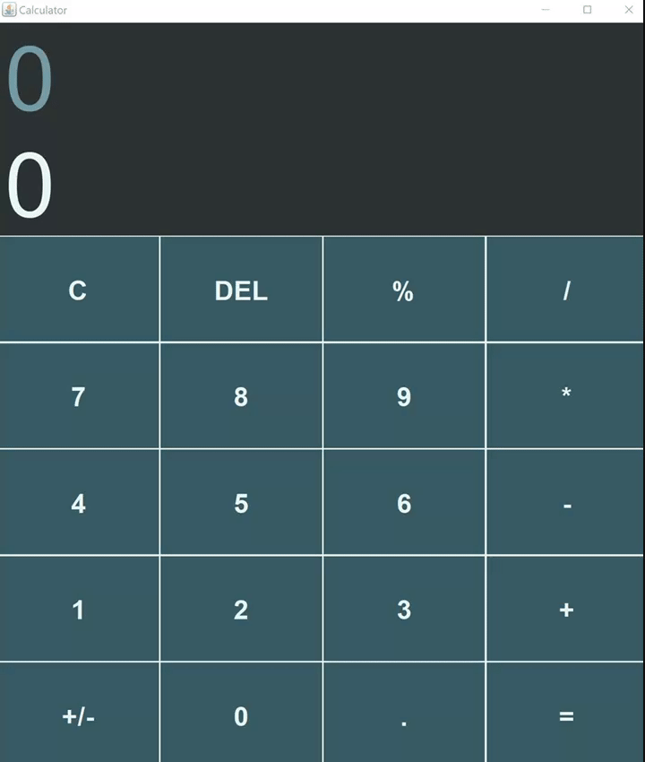

# JavaCalculator
#### Description:
Me and my friend challenged each other to make a GUI based app in Java since we never used any GUI frameworks before so we decided to try making a calculator to start out. This is what mine turned out like!

<br>

#### How to compile:
1- Make sure you have maven installed and Java 17

2- Run the following in your terminal while being in the project root
```shell
mvn package
```

3- Execute the jar by running the following from the project root
```shell
java -jar target/javacalculator-1.0-SNAPSHOT-shaded.jar 
```

<br>
<br>

#### Preview: 

[]()
